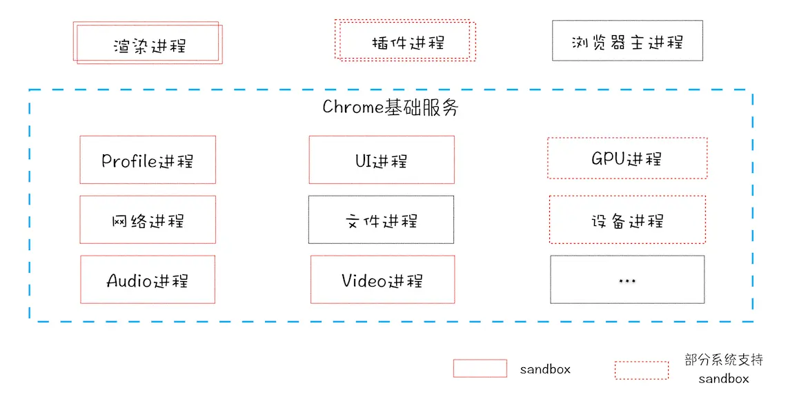

# 浏览器原理

## 浏览器架构由哪几部分组成


- 浏览器进程：浏览器界面显示、用户交互、管理其他进程、提供存储功能
- GPU 进程：与 CPU 交互实现 3D CSS 效果
- 网络进程：负责页面的网络资源加载
- 多个渲染进程：核心人物是将 HTML、CSS 和 JS 转换成可用的网页，排版引擎 Blink 和 JS 引擎 V8 都是运行在该进程中。Chrome 会为每个域名下的 Tab 创建一个运行在沙箱模式下的渲染进程。
- 多个插件进程：负责插件的运行，保证插件崩溃不会对浏览器和页面造成影响。

> 特点

- 单进程架构浏览器的不稳定、不流畅、不安全
- 更高的资源占用
- 更复杂的体系架构

面向服务的 Chrome 架构


推动浏览器发展的主要动力是：

- 市场（服务商、用户）
- 网页承载能力越来越多，对运行浏览器环境提出了更多能力的诉求
- 网页内容复杂度上升和用户对体验的诉求
- 周边技术、标准规范的发展

## 浏览器的特性有哪些

- 同源策略
  - 一个域名的网站，不能去请求其他域名网站的内容。
  - 为了浏览器用户的安全性，如果支付页面登录，如果没有跨域限制，此时打开黑产页面如果调用了支付接口就会有问题，浏览器会带上该域名的 cookie 信息。
  - 要求媒体资源都来自本站，这个很难做到，所以做了一些妥协，iframe、src、link、img 这样的标签来请求时候不受同源策略限制，同时也可能带来安全性问题
  - CPS 就是在 head 的 meta 上面限制了本页面 src 标签的来源，可以提高安全性。

## 跨域是什么？怎么跨域？CORS 的请求头怎么去设置

1. 由于浏览器的同源策略，不允许调用不同域的请求。

2. 方式

- JSONP
- 设置 CORS
- Node 正向代理
- nginx 反向代理，对浏览器来说不去跨域...

3. 有做过全局的请求处理吗？比如统一处理登录态？统一处理全局错误？

- axios
- adaptor
- intercepotor

4. 代码题，你能给 xhr 添加 hooks，实现在各个阶段打日志吗？

```

```

## 浏览器安全有哪些

- XSS
  - 存储型：表单提交写入特殊字符标签，在渲染内容时候变成了 HTML 的一部分，给页面插入了危险的脚本。
  - 防范：表单提交时候校验、服务端输出时转义、前端动态模板输出时转义。
  - 动态型：通过再 URL 上拼接的参数，构造成内容的一部分，插入或者执行危险的脚本。
  - 防范：接受和渲染时候转义。
- CSRF
  - 在黑产网站插入一个通过脱离同源策略限制的 scr 标签例如 img，构造一个跨域的请求。
  - 防范
    - 每次返回页面给一个 token 存放在 url 或者 html 内而不是 cookie 中，这样构造请求因为缺失 token 是无法通过校验的。
    - 关键 cookie 设置 SameSite
    - 请求判断请求来源 referrer，这个容易被篡改吗
- SQL 注入：和 XSS 类似，通过参数的特殊构造，让参数成为了 SQL 语法本身的一部分，达到恶意篡改 SQL 本义的目的。

## token 为什么可以防止 CSRF

## 浏览器从 URL 到展示页面的过程

导航流程：网络请求，强缓存判断，DNS，TCP、HTTPS 返回网页，提交文档给渲染进程。
渲染流程：

- DOM:根据 HTML 构建 DOM 树
- 样式：根据 CSS 计算样式
- 布局：根据 DOM 树和样式生成布局树
- 分层：根据布局树生成图层树（层叠上下文、clip）
- 绘制：根据每个图层数分别生成绘制列表，提交到合成线程
- 分块：合成线程将图层分成图快，并在光栅化线程池中将图快转换成位图
- 光栅化和合成：合成线程发送绘图块命令 DrawQuad 给浏览器进程，生成页面，并显示到显示器上。


> CSS 文件如果是外链阻塞了，会阻塞 DOM 树的合成，因为需要去异步等待下载。
> 过程中遇到 JS，不是 defer 和 async 的会去下载等待并执行

> https://time.geekbang.org/column/article/118205

## 重排 重绘 合成分别是？

- 影响布局的几何属性是重排，因为会触发新的的样式计算和布局之后的流程
- 不改布局的绘制属性是重绘，只会引发新的绘制之后的流程。
- CSS 动画是合成，因为只会触发合成线程的合成工作。

## 浏览器提供了哪些 WebAPI、BOM

储存、通信、绘制、浏览器交互、

- setTimeout
- XMLHttpRequest
- RequestAnimateFrame
- RequestIdleCallback

- window
- navigator
- screen
- history 可被拦截，重写就可以
- location 不可被拦截和重写
- document
- event

## eventLoop 是怎么回事

eventLoop 是页面渲染进程的主旋律。  
是一种任务消化调度机制，主要是优先级调度算法。  
会去任务队列里面去拿取任务执行，每一个任务被称作是宏任务，分别回去调用渲染引擎和 JS 引擎去执行相应的工作。  
消息队列会有 IO 线程和 JS 本身往里面塞任务。


## 浏览器、v8、DOM 以及 eventLoop 的关系是怎么样的

浏览器是 V8 的调用者，存在多个 V8 实例。  
浏览器解析 HTML 给渲染主线程提供了 DOM。  
eventLoop 是渲染主线程运作的模式，会去执行页面解析、渲染和 JS 执行任务。

## 前端体验性能优化跟浏览器原理有什么关系

网页体验性能的瓶颈一般是，根据 Vitas 指标体系：展示慢，交互响应慢，渲染偏移大。  
针对这三个问题，我们可以结合浏览器自身的加载、响应、渲染三个任务去避开雷区，使用优化实践，提供较优内容。  
让浏览器在这三个事情上跳过不必要阶段、避免较长执行时间、合理绘制去工作。

## 如何进行跨标签页面通信

- 利用标签页共享的 cookie 和 LocalStorage，轮询或者监听

```JS
window.addEventListener("storage",function(event){
  $("#name").val(event.key+”=”+event.newValue);
});
```

- 利用服务端介入提供的 WebSokets
