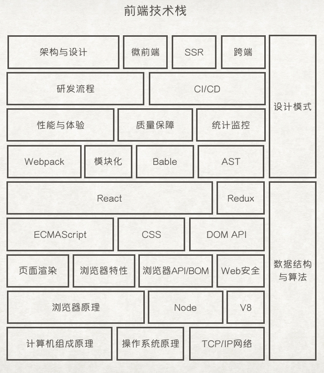

## Front-End Interview

技术栈这个词再形象不过。

- #### [计算机组成原理](./计算机组成原理)
    - [冯诺依曼计算机架构]
    - [寄存器]
    - [CPU流水线]
    - [CPU中断]
- #### [操作系统](./操作系统)
    - [进程线程]
    - [调度算法]
- #### [计算机网络](./计算机网络)
    - [DNS]
    - [CDN]
    - [UDP]
    - [TCP]
    - [HTTP]
    - [HTTPS]
    - [HTTP2]
    - [HTTP3]
- #### [浏览器原理](./浏览器原理)
    - [浏览器架构]
    - [浏览器特性]
    - [浏览器渲染过程]
    - [Web安全]
- #### [Node](./Node)
    - [EventLoop]
    - [Stream]
    - [Cluster]
    - [Process]
    - [进程守护]
- #### [ECMAScript](./ECMAScript)
    - [执行原理]
    - [WeakMap/Set]
    - [原型链]
    - [箭头函数]
    - [Promise]
- #### [React]
    - [状态变更流程]
    - [vdom-diff]
    - [fiber]
    - [hooks]
    - [Redux]
- #### [Webpack]
    - [模块化]
    - [Babel]
    - [AST]
    - [loader/plugin]
    - [构建流程]
    - [构建优化]
- #### 工程
    - [性能优化]
    - [监控统计]
    - [质量保障]
    - [CI/CD]
- #### 架构设计
    - [架构与工程概述]
    - [部署/应用/业务架构]
    - [微前端]
    - [SSR]
    - [开单]
    - [秒杀]
- #### 数据结构与算法
    - [动态规划]
    - [二叉树]
    - [链表]
    - [双指针]
- #### [设计模式](./设计模式)
- #### 团队管理
    - [研发流程建设]
    - [基础设施建设]
    - [技术氛围打造]
    - [人才成长与梯队建设]

旧的
- #### [HTML](./html)
- #### [CSS](./css)
- #### [JavaScript](./javascript)
- #### [DOM/浏览器](./dom) 
- #### [算法编程](./algorithm)
- #### [React](./react)
- #### [性能优化](./performance)
- #### [项目构建/webpack](./webpack)
- #### [HTTP/Web安全](./http)
- #### [前端评级的生疏知识点](./fe)

> https://github.com/CyC2018/CS-Notes

