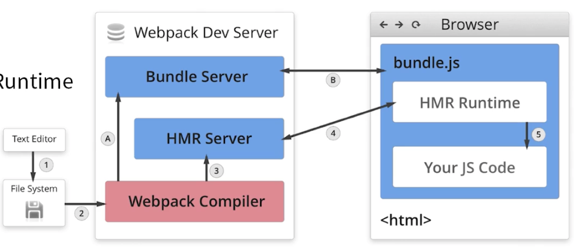

# Webpack
### ESM和CJM有什么本质的区别？
CommonJS 是Node一开始实现的模块化方案，他有一些特点，没有异步请求模块问题。
CommonJS 利用这几个api来实现模块化，require/module/exports。
每一个模块会被函数包裹，传入参数，被其他模块require的时候才会去动态执行。

ES Modules 是ECMAScript借鉴社区的模块化方案形成的。
主要的特征是静态分析引入依赖，在编译时候就确定了。
ES6的模块不是对象，import命令会被 JavaScript 引擎静态分析，在编译时就引入模块代码，而不是在代码运行时加载，所以无法实现条件加载。也正因为这个，使得静态分析成为可能。
ES Modules 支持编译时候去除无用代码。

区别：

CommonJS 运行时加载，输出的是值拷贝，通过函数传参确定了。
ES Modules 编译时输出接口，输出值引用。支持静态分析

[前端模块化——彻底搞懂AMD、CMD、ESM和CommonJS](https://www.cnblogs.com/chenwenhao/p/12153332.html)

### 手写一个精简的webpack
1. 读取webpack.config.js，获取config
2. 运行webpack的compiler，传入config
3. 从entry开始递归打包
    1. 先转换成ast然后transform成es5的代码
    2. 拿到ast分析import的依赖value
    3. 对values进行打包
4. 获取到所有的modules之后塞入模板内
5. 输出到output文件

### webpack的loader和plugin有什么区别？
- loader的触发机制是分析依赖到正则匹配的文件
- loader的本质是对source进行处理的函数
- plugin的触发机制是webpack的事件流程触发了plugin绑定的钩子函数
- plugin的本质是在webpack打包的流程中节点上获取compition对象做辅助流程的事务

### webpack的构建速度和生产内容优化
1. 分析工具
    - 内置的states.json 可以看到产物的json
    - speed-measure-webpack-plugin 可以看到每个loader和插件执行耗时和整个打包耗时
    - webpack-bundle-analyzer 可视化模块体积和构成
2. 构建速度优化
    - 多进程构建 thread-loader/parallel-uglify-plugin让loader和plugin利用Node多进程
    - 基础库分离 利用DLL-plugin进行分包
    - 利用缓存提升二次构建速度
    - 缩小构建目标 loader更精准的匹配
    - 减少文件搜索范围 优化resolve配置、合理使用alias
    - 使用更高版本的webpack和Node
3. 打包产物优化
    - CommonChunk
    - 动态import和代码分割
    - 合理的资源内联
    - treeShaking DCE/ES6
    - Scope Hoisting 尽可能把模块的代码按照引用顺序放在一个闭包里，然后重命名变量防止冲突
    - 动态Polyfill服务

### Webpack的热更新是怎么做到的？原理是怎么样的？
#### 过程
1. webpack监听代码变化，执行编译
2. 通过websocket通知浏览器
3. HRM runtime 替换内存中的模块，如果无法更新就刷新页面
#### 结构
- Webpack Compile：将 JS 编译成 Bundle
- HMR Server：将热更新的文件输出给 HMR Runtime
- Bundle Server：提供文件在浏览器访问
- HMR Runtime：会被注入到浏览器，更新文件的变化
- bundle.js：构建输出的文件

### Webpack如何实现SSR打包？
服务端
- 使用react-dom/server的renderToString方法将React组件渲染成字符串
- 服务端路由返回对应的模板
客户端
- 打包出针对服务端的组件

### 为什么SSR比CSR快？
#### SSR的过程
在服务端完成了额外的业务数据请求，模板渲染，浏览器一拿到就可以进行DOM树、样式计算、合成、分层、绘制，生成真正的可见内容。
#### CSR的过程
在服务端完成了基本的用户数据请求，返回模板，浏览器拿到渲染的是空的页面，然后加载执行JS，然后网络请求，插入DOM，再开始重排。
#### 区别
- 内网机器拉取数据更快，减少客户端的网络请求。
- CSR对于耗时的网络任务没有充分利用并行，时间浪费在串行的网络传输中，页面DOM更新，渲染后置。

