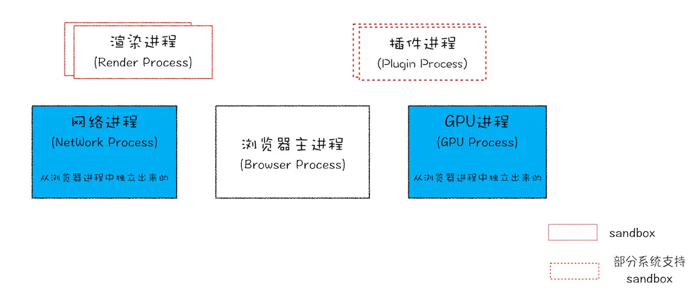
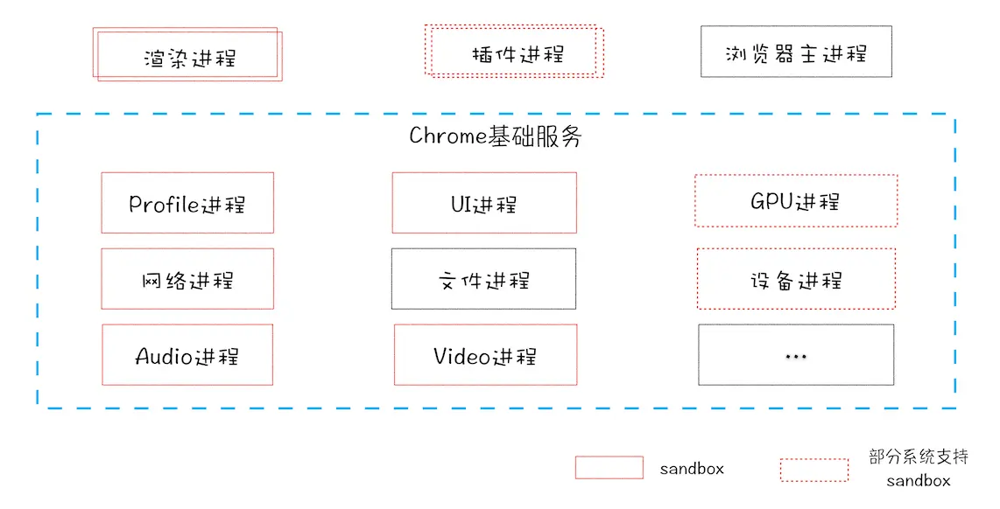

### 浏览器架构由哪几部分组成

- 浏览器进程：浏览器界面显示、用户交互、管理其他进程、提供存储功能
- GPU进程：与CPU交互实现3D CSS效果
- 网络进程：负责页面的网络资源加载
- 多个渲染进程：核心人物是将HTML、CSS和JS转换成可用的网页，排版引擎Blink和JS引擎V8都是运行在该进程中。Chrome会为每个域名下的Tab创建一个运行在沙箱模式下的渲染进程。
- 多个插件进程：负责插件的运行，保证插件崩溃不会对浏览器和页面造成影响。

> 特点
- 单进程架构浏览器的不稳定、不流畅、不安全
- 更高的资源占用
- 更复杂的体系架构

面向服务的Chrome架构

推动浏览器发展的主要动力是：
- 市场（服务商、用户）
- 网页承载能力越来越多，对运行浏览器环境提出了更多能力的诉求
- 网页内容复杂度上升和用户对体验的诉求
- 周边技术、标准规范的发展

### 浏览器的特性有哪些
- 同源策略
    - 一个域名的网站，不能去请求其他域名网站的内容。
    - 为了浏览器用户的安全性，如果支付页面登录，如果没有跨域限制，此时打开黑产页面如果调用了支付接口就会有问题，浏览器会带上该域名的cookie信息。
    - 要求媒体资源都来自本站，这个很难做到，所以做了一些妥协，iframe、src、link、img这样的标签来请求时候不受同源策略限制，同时也可能带来安全性问题
    - CPS就是在head的meta上面限制了本页面src标签的来源，可以提高安全性。

### 浏览器安全有哪些
- XSS
    - 存储型：表单提交写入特殊字符标签，在渲染内容时候变成了HTML的一部分，给页面插入了危险的脚本。
    - 防范：表单提交时候校验、服务端输出时转义、前端动态模板输出时转义。
    - 动态型：通过再URL上拼接的参数，构造成内容的一部分，插入或者执行危险的脚本。
    - 防范：接受和渲染时候转义。
- CSRF
    - 在黑产网站插入一个通过脱离同源策略限制的scr标签例如img，构造一个跨域的请求。
    - 防范
        - 每次返回页面给一个token存放在url或者html内而不是cookie中，这样构造请求因为缺失token是无法通过校验的。
        - 请求判断请求来源referrer，这个容易被篡改吗
- SQL注入：和XSS类似，通过参数的特殊构造，让参数成为了SQL语法本身的一部分，达到恶意篡改SQL本义的目的。

### 浏览器从URL到展示页面的过程
导航流程：网络请求，强缓存判断，DNS，TCP、HTTPS返回网页，提交文档给渲染进程。
渲染流程：解析HTML，生成DOM。解析CSS，计算布局，可能会触发GPU。
分层计算出布局
栅格化
生成页面内容
过程中遇到JS，不是defer和async的会去下载等待并执行

> https://time.geekbang.org/column/article/118205

### 浏览器提供了哪些API，BOM
- setTimeout
- XMLHttpRequest
- RequestAnimateFrame
- RequestIdleCallback

### eventLoop是怎么回事

### 浏览器、v8、DOM以及eventLoop的关系是怎么样的

### 前端性能优化跟浏览器原理有什么关系
