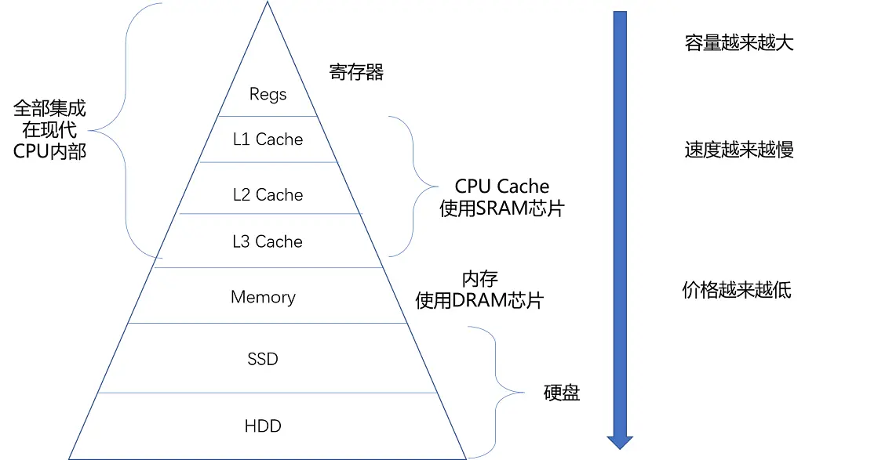
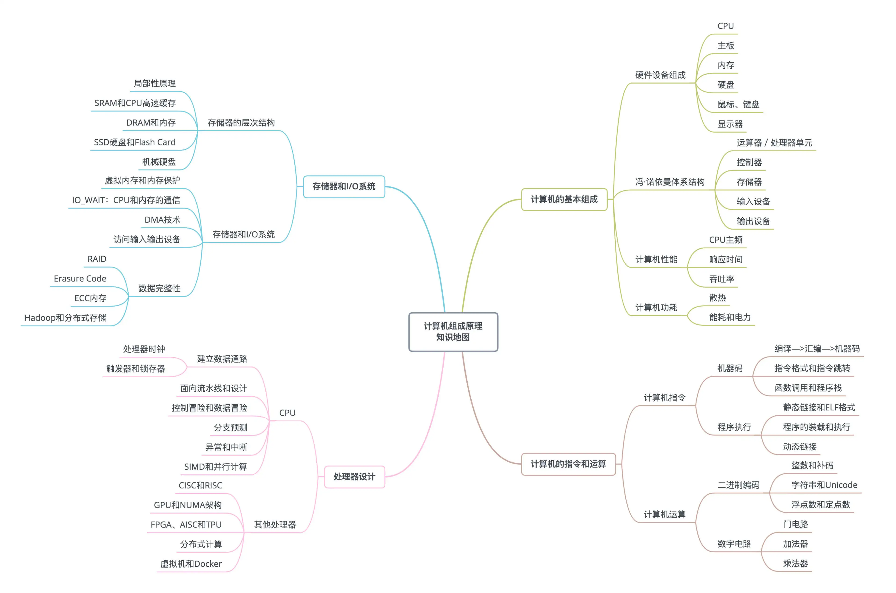

# 计算机组成原理

## 冯诺依曼计算机体系

存储程序计算机：可编程、存储

输入输出设备
控制器
运算器
寄存器

## 二进制编码

控制晶体二极管的通电与否，组成各种电路门来进行运算。

## CPU 性能由什么决定

指标：响应时间、吞吐率
程序的性能：指令数*CPI*时钟周期

## 说下 CPU 流水线

CPU 流水线是硬件级别的并行。
CPU 的结构是一个个独立的组合逻辑电路串联的，去执行一条指令会浪费 CPU 的计算能力。
把时间周期切分成一个指令的一个阶段。
同时就可以执行好几个指令，CPU 的每个片区的电路都尽可能用上了。

流水线分的阶段越多，同时处理的指令就越多。

但是也不是越多越好，和 CPU 的核数相似，达到一定数量，性能不升反降，原因是？流水线各个阶段的转接需要进过流水线寄存器，从寄存器存入读取的消耗会越来越多。

## CPU 中断是怎么回事

查表法，保留现场信息，上下文切换，像一次进程的切换。

## 说下 CPU 的寄存器和三级缓存

控制器和运算器从寄存器拿取指令运行，是当下的。
L1 缓存一般在核内部，L2 缓存不在核内部，L3 缓存多核共用。
特点：越往下越慢

## 计算机组成原理的知识地图

> [深入浅出计算机组成原理-极客时间](https://time.geekbang.org/column/intro/170) > [计算机组成（视频课程）](https://www.coursera.org/learn/jisuanji-zucheng?action=enroll)
